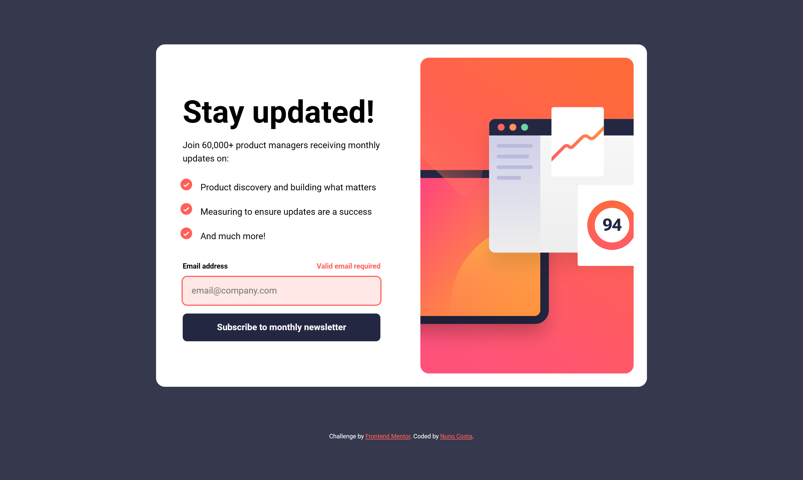
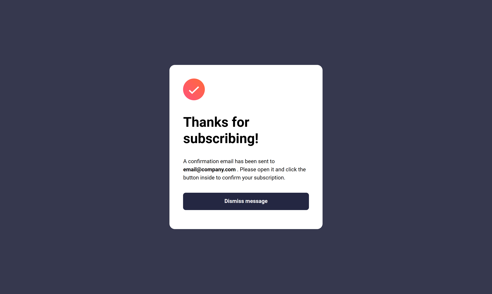
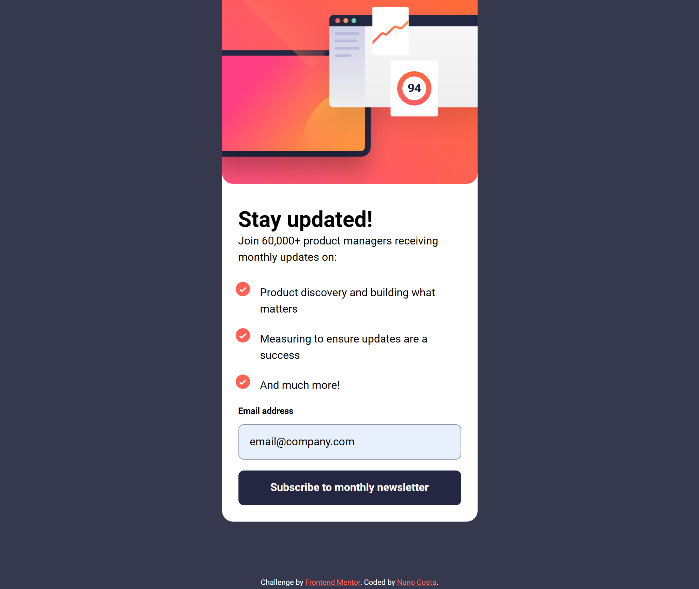
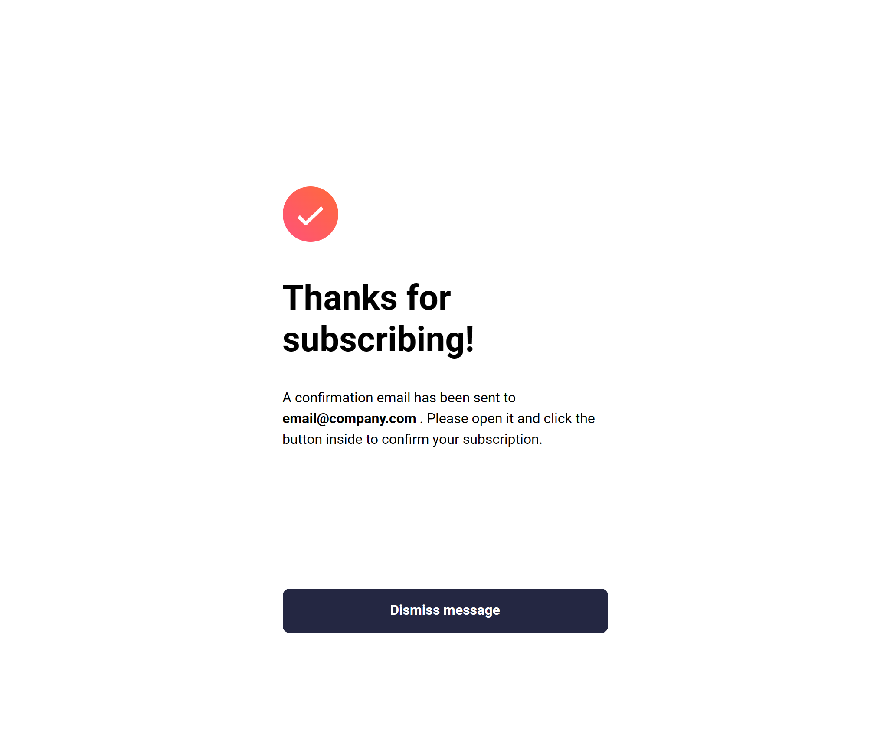

# Frontend Mentor - Newsletter sign-up form with success message solution

This is a solution to the [Newsletter sign-up form with success message challenge on Frontend Mentor](https://www.frontendmentor.io/challenges/newsletter-signup-form-with-success-message-3FC1AZbNrv). Frontend Mentor challenges help you improve your coding skills by building realistic projects.

## Table of contents

- [Overview](#overview)
  - [The challenge](#the-challenge)
  - [Screenshot](#screenshot)
  - [Links](#links)
- [My process](#my-process)
  - [Built with](#built-with)
  - [What I learned](#what-i-learned)
  - [Continued development](#continued-development)
- [Author](#author)

## Overview

### The challenge

Users should be able to:

- Add their email and submit the form
- See a success message with their email after successfully submitting the form
- See form validation messages if:
  - The field is left empty
  - The email address is not formatted correctly
- View the optimal layout for the interface depending on their device's screen size
- See hover and focus states for all interactive elements on the page

### Screenshot

<h4 align="center"><strong>Desktop Design</strong></h4>

<p align="center">

<p align="center">


<h4 align="center"><strong>Mobile Design</strong></h4>

<p align="center">

<p align="center">


### Links

- Solution URL: [Solution URL](https://www.frontendmentor.io/solutions/newsletter-signup-form-htmlcssjs-mzUY4sAXvM)
- Live Site URL: [Live site URL](https://newsletter-sign-up-with-success-message-challenge.vercel.app/)

## My process

### Built with

- Semantic HTML5 markup
- CSS custom properties
- Flexbox
- CSS Grid
- Mobile-first workflow
- Vite

### What I learned

For this project I learned how to use Vite, which is a frontend tool that gives us access to different feature such as:

- NPM Dependency Resolving and Pre-Bundling that allows us to use bare module imports:

```js
// main.js
import "../styles/utils.css";

import displayErrorMsg from "./utils/displayErrorMsg";
displayErrorMsg();

// displayErrorMsg.js
const displayErrorMsg = () => {
  ...
};

export default displayErrorMsg;
```

- Hot Module Replacement which is basically the same as VSCode's live server but way faster.

- And many more...

Furthermore, I feel like with this project my organization improved quite a lot. In my opinion, every file is stored where it should be. Moreover, in terms of class names for the different html elements I feel like in this project everything was organized.

```html
<section class="app container section">
  <div class="app__form">
    <h2 class="app__form-title">Stay updated!</h2>
  </div>
</section>
```

### Continued development

For the next projects, I want to keep this level of organization and I will probably start using Vite regularly.

## Author

- Frontend Mentor - [@Bottom17](https://www.frontendmentor.io/profile/Bottom17)
